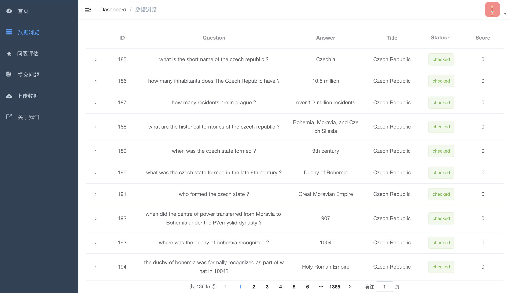
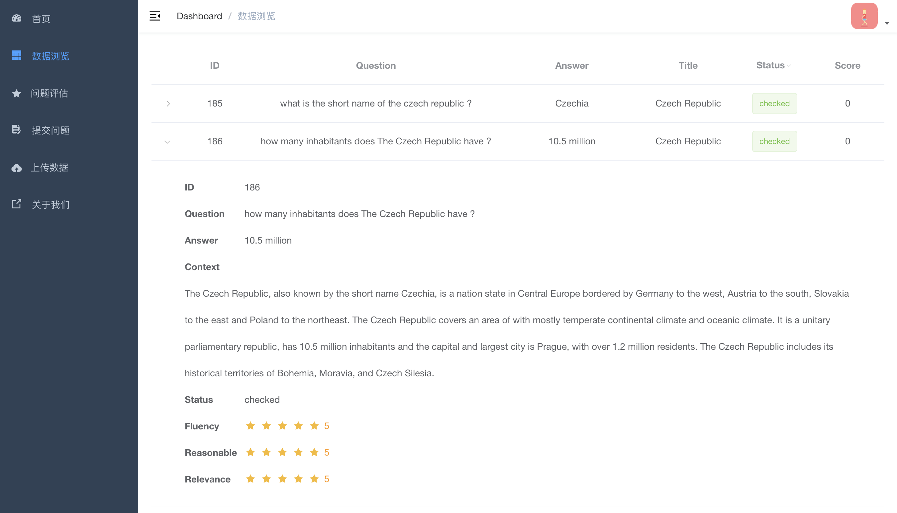
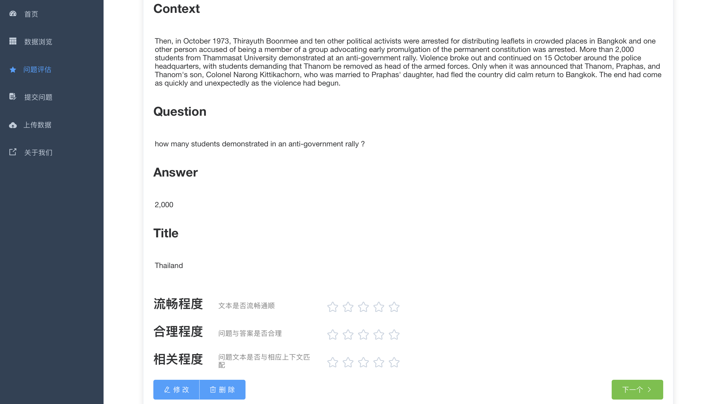
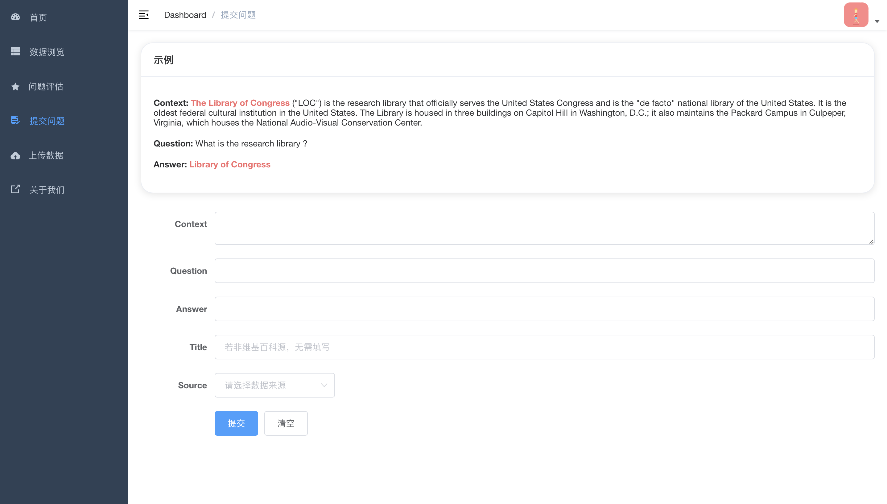

 > 本项目实现自脚手架 [vue-admin-template](https://github.com/PanJiaChen/vue-admin-template)

主要用于对**问题生成数据集**的管理以及评估。

[对应后端仓库](https://github.com/Congregalis/QGSystem)

## Demo

[线上demo](http://zscl.xjtudlc.com:8089/)

## 使用

安装依赖

`npm install`

开发者模式启动（用于调试）

`npm run dev`

打包发布

`npm run build:prod`

项目根目录下得到的 dict 即为项目包，放于 nginx 下运行即可
